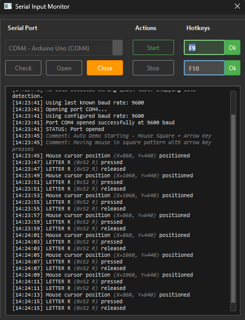
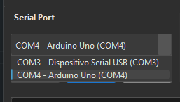
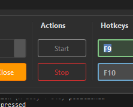

# Serial Input Monitor

## 📖 **Overview**

**Serial Input Monitor** is a comprehensive system that enables **mouse and keyboard control** through serial communication with an **Arduino Uno**. Unlike solutions that require Arduino Leonardo or other HID-capable microcontrollers, this system works with the **standard Arduino Uno** that most makers already have.

**This system bridges the gap** by making Arduino Uno work like an HID device through intelligent serial communication!

## 📸 **Screenshots**

### Main Interface


The main interface provides real-time monitoring of serial communication with automatic baud rate detection, professional logging, and intuitive controls.

<details>
<summary>📁 More Screenshots</summary>

### Port Selection


The port selection automatically refreshes available COM ports when you open the dropdown, making it easy to detect newly connected Arduino devices without restarting the application.

### Application Started


When a port is opened, all received serial data is displayed in real-time on screen for monitoring. However, the actual mouse/keyboard actions are only executed when you press Start - you can use Stop to pause actions while still viewing the incoming data.

</details>

## 🎯 **Key Advantages**

### ✅ **Works with Arduino Uno**
- **No need for Arduino Leonardo** or other HID-capable boards
- Uses **standard Arduino Uno** with serial communication
- **Cost-effective solution** for input automation projects

### ✅ **Professional Features**
- **Automatic baud rate detection** (9600, 115200, 57600, 38400, etc.)
- **Real-time data monitoring** with technical and friendly key names
- **Comment support** (lines starting with `#` for debugging)
- **Thread-safe operation** with non-blocking UI
- **Comprehensive error handling** and validation

### ✅ **Complete Development Environment**
- **Arduino examples** for testing without hardware
- **SerialInputMonitor library** for complex Arduino projects
- **Modern Qt6 interface** with professional styling
- **IntelliSense support** for Arduino development

## 🔧 **System Requirements**

- **Python 3.8+** with PySide6
- **Arduino Uno** (or compatible)
- **Windows** (primary support)
- **USB-to-Serial connection**

## 🚀 **Quick Start**

### 1. **Python Environment Setup**

You can choose from different installation methods:

#### **Option A: Using Installation Helper (Recommended)**
```bash
# Clone the repository
git clone <repository-url>
cd SerialInputMonitor

# Run the installation helper to see all options
python install_helper.py
```

The installation helper will show you:
- **Basic installation** (core features only)
- **Full installation** (with Windows shortcuts)
- **Modern installation** (using pyproject.toml)
- **Current environment status**

#### **Option B: Manual Installation**
```bash
# Create virtual environment
python -m venv .venv
.venv\Scripts\activate

# Install dependencies
pip install -r requirements.txt

# For Windows shortcut features (optional)
pip install winshell pywin32
```

#### **Option C: Modern Setup (Development)**
```bash
# Install in editable mode
pip install -e .

# With Windows extras
pip install -e .[windows]

# With development tools
pip install -e .[dev]
```

### 2. **Arduino Setup**
Upload one of the provided examples to your Arduino Uno:

- **`example_minimal.ino`** - Basic data sending
- **`example_simple_test.ino`** - Mouse and keyboard simulation
- **`example_auto_demo.ino`** - Automated testing sequence
- **`example_comments_and_commands.ino`** - Demonstrates comment usage

### 3. **Run the Application**
```bash
python src/main.py
```

## 📁 **Project Structure**

```
SerialInputMonitor/
├── src/
│   ├── main.py                 # Main application with auto-detection
│   ├── key_mappings.py         # Comprehensive key mapping system
│   └── ui/
│       ├── main_ui.py          # Generated UI code
│       ├── main_ui.ui          # Qt Designer interface file
│       └── themes/
│           └── default.qss     # Professional styling
├── arduino/
│   ├── SerialInputMonitor.h    # Arduino library header
│   ├── SerialInputMonitor.cpp  # Arduino library implementation
│   └── examples/               # Testing examples
├── install_helper.py           # Installation guidance script
├── setup.py                    # Modern setuptools configuration
├── pyproject.toml             # Project metadata and dependencies
├── config.ini                 # Application configuration
└── requirements.txt           # Python dependencies
```

## 🎮 **Arduino Examples Explained**

### **Simple Examples (No Library Required)**

These examples only **send data** to the PC and don't require the SerialInputMonitor library:

#### **`example_minimal.ino`**
```cpp
// Sends basic mouse movements
Serial.println("0 1 5 -3");  // Mouse move: device=0, event=1, x=5, y=-3
```

#### **`example_simple_test.ino`**
```cpp
// Simulates mouse clicks and keyboard presses
Serial.println("0 2");        // Mouse left click
Serial.println("1 1 0x41");   // Keyboard: press 'A'
```

#### **`example_auto_demo.ino`**
```cpp
// Automated testing sequence with comments
Serial.println("# Starting mouse test");
Serial.println("0 1 10 0");   // Move mouse right
Serial.println("# Mouse movement completed");
```

### **Advanced Examples (Library Required)**

Use the SerialInputMonitor library when you need the Arduino to **receive and process commands** from the PC:

#### **`example_using_library.ino`**
```cpp
#include "SerialInputMonitor.h"

SerialInputMonitor monitor;

void setup() {
  monitor.begin();  // Initialize command processing
}

void loop() {
  monitor.processIncomingData();  // Handle PC commands
  // Arduino can now receive: "LED_ON", "SERVO_90", etc.
}
```

## 📋 **Communication Protocol**

### **Data Format**
```
DEVICE EVENT [PARAM1] [PARAM2]
```

### **Device Types**
- **`0`** = Mouse
- **`1`** = Keyboard

### **Mouse Events**
- **`1`** = Move relative (`0 1 deltaX deltaY`)
- **`2`** = Left click (`0 2`)
- **`3`** = Right click (`0 3`)
- **`6`** = Scroll (`0 6 scrollAmount`)
- **`7`** = Set position (`0 7 x y`)

### **Keyboard Events**
- **`1`** = Key press (`1 1 0x41` = Press 'A')
- **`0`** = Key release (`1 0 0x41` = Release 'A')

### **Comments**
```
# This is a comment - shown in log but no action taken
```

## 🔍 **When to Use SerialInputMonitor Library**

### **❌ Library NOT Required:**
- **Sending data** from Arduino to PC
- **Testing** the PC application
- **Simple sensor readings**
- **Basic automation** (Arduino → PC)

### **✅ Library Required:**
- **Receiving commands** from PC to Arduino
- **Controlling Arduino** hardware via PC commands
- **Complex communication** protocols
- **Bidirectional control** (PC ↔ Arduino)

### **Example Comparison:**

**Without Library (Simple):**
```cpp
// Arduino only SENDS data
Serial.println("0 1 5 -2");  // Send mouse movement
```

**With Library (Advanced):**
```cpp
// Arduino can RECEIVE and PROCESS commands
#include "SerialInputMonitor.h"
SerialInputMonitor monitor;

void loop() {
  monitor.processIncomingData();  // Handle "LED_ON", "SERVO_90", etc.
}
```

## ⚙️ **Features in Detail**

### **Automatic Baud Rate Detection**
- Tests common baud rates: **9600, 115200, 57600, 38400, 19200**
- **Prioritizes** previously successful rates
- **Quick data test** before full detection
- **Fallback** to configured rate if no data detected

### **Smart Data Processing**
- **Validates** data format before processing
- **Handles** partial/malformed data gracefully
- **Converts** hex key codes to friendly names
- **Technical logging** with styled output

### **Professional UI**
- **Non-blocking** interface with threading
- **Real-time** data monitoring
- **Port checking** before connection
- **Status indicators** and progress feedback

### **Comment System**
```cpp
Serial.println("# Debug: Starting sequence");  // Shown in gray, italic
Serial.println("0 1 10 0");                   // Processed as mouse move
Serial.println("# Debug: Movement completed"); // Another comment
```

## 🛠️ **Development Setup**

### **VS Code Configuration**
The project includes IntelliSense configuration for Arduino development:

- **`.vscode/c_cpp_properties.json`** - C++ paths and settings
- **`.vscode/arduino.json`** - Arduino-specific configuration
- **`.copilot-instructions.md`** - AI assistant guidelines

### **Python Dependencies**
```txt
PySide6==6.8.0      # Modern Qt6 interface
pyserial==3.5       # Serial communication
keyboard==0.13.5    # Keyboard control
```
## 📝 **Configuration**

### **config.ini**
```ini
[Serial]
last_port = COM3
baud_rate = 9600
auto_detect_baud = true

[UI]
log_font_size = 9
max_log_lines = 1000
```

## 🐛 **Troubleshooting**

### **Arduino Not Detected**
1. Check **USB connection**
2. Verify **correct COM port**
3. Try **different baud rates**
4. Click **"Check"** before **"Open"**

### **No Data Received**
1. Upload **example sketch** to Arduino
2. Check **serial monitor** for output
3. Verify **baud rate** matches Arduino code
4. Enable **auto-detection**

### **Key Mapping Issues**
- Check `key_mappings.py` for **supported keys**
- Use **hex format** for key codes (`0x41` for 'A')
- Verify **DEVICE EVENT** format

## 📄 **License**

This project is released under the **MIT License**. Feel free to use, modify, and distribute according to the license terms.

## 👥 **Contributing**

Contributions are welcome! Please:
1. **Fork** the repository
2. Create a **feature branch**
3. **Test** your changes thoroughly
4. Submit a **pull request**

---

**Made with ❤️ for the Arduino and Python communities**
